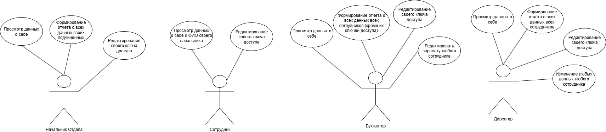
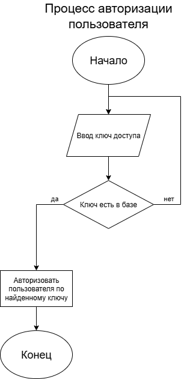

# О системе
Система предназначена для работы с базой данных сотрудников компании.

Она позволяет отслеживать данные о сотрудниках и управлять ими (если вы являетесь *Директором*/*Бухгалтером*), а *Сотрудник* может узнать свои данные и начальника своего отдела/своих подчинённых, если он *Начальник Отдела*.
___
## Пользователи системы и их роли
- *Директор*  – может добавлять и удалять сотрудников, просматривать* и редактировать все их данные** (кроме зарплаты), редактировать свой ключ доступа
- *Бухгалтер* – может просматривать все данные сотрудников (кроме ключа доступа), редактировать их зарплату, редактировать свой ключ доступа
- *Сотрудник* – может просматривать свои данные и ФИО начальника своего отдела, редактировать свой ключ доступа
- *Начальник Отдела* – может просматривать свои данные и данные подчинённых своего отдела, редактировать свой ключ доступа
###### * Под "просмотром данных" подрузамевается формирование отчёта о доступных данных.
###### ** Данные включают в себя ФИО, отдел, должность, размер зарплаты, является ли сотрудник начальником отдела, ключ доступа.
___
## Список основных функций
Просмотр данных о сотруднике/сотрудниках, их редактирование и добавление новых, система авторизации с помощью ключей доступа.
___
## Use case диаграмма

___
## Блок схемы

___
***Проект реализован на языке C++ с использованием платформы Visual Studio и библиотеки SQLite***
